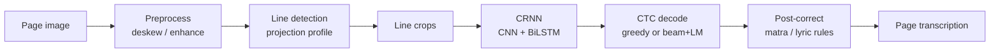

# End-to-End Optical Character Recognition for Printed Sinhala Documents

**Degree programme:** MSc in Computer Science  
**Institution:** University of Moratuwa  
**Student:** ________________________  
**Supervisor:** ________________________  
**Project repository:** `sinhala-document-ocr`  
**Delivered checkpoint:** `models/crnn_best.pth`  
**Primary results reference:** `RESULTS.md` (reproducible suite)

---

## Overall summary

This project implements a complete page-level OCR pipeline for **printed** Sinhala
documents (poems, book pages, lyric cards, mixed Sinhala–English layouts). A page
image is deskewed, text lines are detected with a classical projection-profile
method, each line is recognised by a CRNN trained with CTC, and the decoding stage
combines CTC beam search, a character *n*-gram language model, and a small set of
measured Sinhala orthographic post-corrections.

The headline **held-out** result on real photographed pages (2 pages, 32 lines,
never seen in training) is end-to-end **CER 0.0325** (**Character Accuracy 96.75%**)
and **WER 0.1491** (**Word Accuracy 85.09%**). On held-out synthetic pages the
pipeline reaches CER **0.0088** (Character Accuracy **99.12%**). Line detection is
exact on every page in the evaluation suite. The work deliberately separates
*held-out* evidence from *in-training* reference scores, because synthetic
validation CER alone was shown to be a misleading model-selection signal.

---

## 1. Title and student context

| Field | Value |
|---|---|
| Title | End-to-End Optical Character Recognition for Printed Sinhala Documents |
| Programme | MSc in Computer Science, University of Moratuwa |
| Scope language | Sinhala (printed); Tamil and handwriting out of scope |
| Demo notebook | `notebooks/local_pipeline.ipynb` |
| Colab notebook | `notebooks/colab_pipeline.ipynb` |

---

## 2. Abstract / executive summary

Optical Character Recognition (OCR) for Sinhala remains harder than for Latin
scripts because of a large grapheme inventory, complex matra / modifier
composition (including pre-base vowels), Zero-Width Joiner (ZWJ) conjuncts, and a
shortage of large publicly labelled page datasets. This project builds a practical
end-to-end system that can be trained and run on a single consumer GPU.

The system comprises five stages: acquisition, preprocessing (deskew / contrast),
line detection, CRNN+CTC recognition, and post-processing (beam+LM decode and
matra/lyric correction). Training data combine synthetic text lines, detector-in-
the-loop page crops, and a modest set of real annotated lines. Evaluation is
reported end-to-end so that detection mistakes count against accuracy.

On the clean real-photo holdout, Character Accuracy reaches **96.75%** (CER
0.0325) and Word Accuracy **85.09%** (WER 0.1491). Remaining errors concentrate
on very low-resolution lyric text and a few serif-print confusions (`ු`/`ූ`,
`ේ`/`ී`). The delivered artefact is one general checkpoint plus a Jupyter demo
that examiners can run without retraining.

---

## 3. Problem statement and motivation

Sri Lanka produces large volumes of printed Sinhala material—school texts, forms,
literary works, song lyric cards, and archival scans. Digitising these pages by
hand is slow. Generic multilingual OCR engines often under-serve Sinhala
orthography: pre-base kombuva placement, conjuncts formed with ZWJ, and mixed
Sinhala–English tokens all introduce failure modes that a Latin-centric stack does
not face.

Phone photographs of pages add further difficulty: skew, uneven lighting, JPEG
compression, and lines that may be only 12–24 px tall after cropping. An MSc-scale
project cannot collect millions of labelled real lines, so the methodological
question is how to combine synthetic data with a small real set **without**
over-claiming generalisation from synthetic validation scores.

---

## 4. Objectives

1. Design and implement a full page → text OCR pipeline for printed Sinhala.
2. Train a CRNN+CTC recogniser on synthetic + real data using a consumer GPU.
3. Detect text lines robustly enough that held-out page evaluation is meaningful.
4. Report **honest** held-out metrics (CER/WER and accuracy percentages), with a
   clear separation from in-training reference sets.
5. Provide a reproducible demo notebook and documentation suitable for a review
   panel / viva.

---

## 5. Scope and limitations

**In scope**

* Printed Sinhala pages (and mixed Latin tokens that appear on those pages).
* Phone / scanner images of mostly upright pages.
* Line-level recognition with page-level evaluation.

**Out of scope**

* Handwriting.
* Tamil or other Sri Lankan languages.
* Fully learned text detectors (e.g. DBNet) as the primary delivered path.
* Large-scale production deployment / API service.

**Known limitations** (see also `RESULTS.md` §4)

* Clean real-image holdout is small: **2 pages / 32 lines**.
* Residual grapheme confusions on tiny lyric crops (`ේ`/`ී`, `්`/`ි`, `ඟ`/`ග`).
* Long `ූ` vs short `ු` on traditional serif faces is only partly solved.
* Logos and decorative display fonts are not suppressed by the detector.

---

## 6. Literature / related work (brief)

Classical OCR for Indic scripts typically separates layout analysis from sequence
recognition. The CRNN architecture of Shi et al. (CNN backbone + bidirectional
LSTM + CTC) remains a strong baseline for line recognition when labelled data are
limited, because CTC removes the need for character-level bounding boxes.

Connectionist Temporal Classification (Graves et al.) is the standard alignment-
free loss for OCR line models. Scene-text and document OCR surveys (e.g. recent
work on STR benchmarks) emphasise that **train–test domain mismatch**—especially
synthetic versus real camera images—often dominates architecture choice.

For Sinhala specifically, public resources are thinner than for Devanagari or
Tamil. This project therefore invests in (i) a grapheme-aware charset including
ZWJ, (ii) synthetic rendering with multiple Sinhala fonts, and (iii) page-level
evaluation that includes the detector. Transformer OCR models (TrOCR / PARSeq)
were considered as optional alternatives in the repository design notes, but the
delivered, fully trained path is CRNN+CTC: it fits the available GPU budget and
is transparent for an MSc examination.

---

## 7. System architecture



| Stage | Module | Role |
|---|---|---|
| Preprocess | `src/preprocessing/` | Deskew, denoise / contrast helpers |
| Detection | `src/detection/text_detection.py` | Projection-profile line boxes |
| Recognition | `src/recognition/` | CRNN model, train, inference |
| Charset | `src/charset.py` | 224 printable classes + CTC blank; ZWJ |
| Decode | `src/recognition/decode.py` | Greedy or beam + LM shallow fusion |
| Post-correct | `src/postprocess/sinhala_fix.py` | Measured orthographic fixes |
| Eval | `src/evaluation/`, `scripts/run_eval_suite.py` | End-to-end CER/WER |

---

## 8. Methodology

### 8.1 Preprocessing

Pages may be slightly rotated. The detector path estimates a deskew angle
(ignored if below `deskew_min_angle`) and rotates before projection. Contrast
helpers (CLAHE / unsharp) exist for experiments; the delivered default keeps
photometric TTA **off** after measured trade-offs (`RESULTS.md` §3d).

### 8.2 Line detection

Horizontal projection profiles locate text bands. Filters remove boxes that are
too short relative to the median line height, and tall bands can be re-split for
mixed layouts. On the evaluation suite, detection recovered **76/76**, **9/9** and
**23/23** lines on the synthetic and two real pages respectively.

### 8.3 Recognition (CRNN + CTC)

* Input height: **48 px**, greyscale, variable width (max 512 in config).
* CNN trunk → BiLSTM (`rnn_hidden=256`, 2 layers) → linear layer over charset.
* Loss: CTC. Labels are Unicode strings encoded through the project charset.
* Short crops at inference are **upscaled** to 48 px (`pad_to_height: false`),
  matching training’s `resize_keep_height` behaviour.

### 8.4 Charset and ZWJ

The shipped `models/charset.json` contains **224** characters plus the CTC blank.
Sinhala conjuncts that require U+200D (ZWJ) are retained as distinct sequences so
that models are not forced to invent impossible compositions. Encoding/decoding
helpers live in `src/charset.py` and are covered by unit tests.

### 8.5 Decoding

Default inference (`configs/local.yaml`):

* `decode: beam_lm`
* `lm_weight: 0.2`, `insertion_bonus: 0.6`, `beam_width: 12`
* Character LM: 6-gram with Witten–Bell interpolation over training-side Sinhala
  text only (`src/postprocess/char_lm.py`)

Score form:

```
score = log P_ctc(y|x) + lm_weight · log P_lm(y) + insertion_bonus · |y|
```

### 8.6 Post-correction

`fix_sinhala_ocr` applies only rules that improve or tie every held-out set:

* Matra / kombuva repairs (`ෙCී`→`Cේ`, word-final `ණී`→`ණේ`, illegal pre-base
  reorder, orphan pre-base+virama).
* LM-gated word-final `මි`→`ම්`.
* Aug-01 lyric polish: `..//`→`...//`, `ලෙලෙ`→`ලෙල`, `වැවි`→`වැව්`,
  `ුණි`→`ුණේ`, line-final `මැවුණ`→`මැවුණේ`.

Blind `ස්සු`→`ස්සූ` and bare `ණි`→`ණේ` were measured and **rejected** because they
regress synthetic holdouts.

---

## 9. Dataset

| Source | Role | Notes |
|---|---|---|
| Synthetic lines (`data/synthetic`) | Primary train/val/test split | Multi-font render + camera-style augment |
| Synthetic pages (`data/synthetic_pages`) | Detector-in-the-loop crops | Real detector run on rendered pages |
| Hard / small lines | Curriculum for tiny text | e.g. `data/synthetic_small` |
| Real labelled lines | Domain adaptation | `user_batch1`, web batch, poem lines |
| `data/eval_pages/` | Held-out synthetic pages | 10 pages, 76 lines |
| `data/eval_real/print_photos/` | **Held-out real photos** | 2 pages, 32 lines |
| `data/eval_real/adversarial/` | Held-out acceptance pages | 3 synthetic stress pages |

Leakage audit (`scripts/check_holdout_leakage.py`):

* `print_photos`, `eval_pages`, `adversarial`: held out.
* `web_batch1_holdout`: partial leak (6/14 transcripts also in train).
* `user_batch1_holdout`, `poem_kanyawee`: **in training** (reference only).

---

## 10. Training procedure and hyperparameters

Delivered weights come from a continue-train round (`configs/mix_jul28.yaml`) on
top of an earlier general CRNN:

| Item | Value |
|---|---|
| Optimiser | Adam |
| Continue-train epochs | 12 |
| Learning rate | 8e−5 → plateau schedule (factor 0.5) |
| Batch size | 32 |
| Input height | 48 |
| Best synthetic val CER | **0.0348** (epoch 12) |
| Hardware (development) | NVIDIA RTX 4060 Laptop GPU |

Important negative result (`RESULTS.md` §3d): a later continue-train reached
**better** synthetic val CER (0.0343) but **worse** every held-out set. That
checkpoint was not promoted. Model selection therefore uses
`scripts/run_eval_suite.py`, not synthetic validation alone.

---

## 11. Evaluation metrics

Let \(R\) be the reference string and \(H\) the hypothesis.

* **CER** = Levenshtein distance on characters / \|R\|  
* **WER** = Levenshtein distance on whitespace-tokenised words / word count(R)  
* **Character Accuracy (%)** = (1 − CER) × 100  
* **Word Accuracy (%)** = (1 − WER) × 100  

Corpus metrics aggregate total edits over total reference length (not a mean of
per-line rates). Page evaluation is end-to-end: detected lines are aligned to GT
lines in order, so missed/merged lines inflate CER.

### Final accuracy table (delivered decode)

| Set | Status | CER | Char Acc. % | WER | Word Acc. % |
|---|---|---|---|---|---|
| Real photos (`print_photos`, 32 lines) | held out | **0.0325** | **96.75** | **0.1491** | **85.09** |
| Synthetic pages (`eval_pages`, 76 lines) | held out | **0.0088** | **99.12** | **0.0226** | **97.74** |
| Adversarial (3 pages) | held out | 0.0351 | 96.49 | 0.0458 | 95.42 |
| Synthetic val (trainer) | trainer split | 0.0348 | 96.52 | 0.0912 | 90.88 |
| `user_batch1` (41 lines) | in train | 0.0035 | 99.65 | 0.0222 | 97.78 |
| `web_batch1` (14 lines) | partial leak | 0.0000 | 100.00 | 0.0000 | 100.00 |
| `poem_kanyawee` (10 lines) | in train | 0.0000 | 100.00 | 0.0000 | 100.00 |

Plots: training loss / val CER–WER curves from `models/train_jul28.log` (or
bundled history JSON); held-out CER bar chart from
`data/metrics/eval_summary.json`, labelled with Character Accuracy %.

---

## 12. Results and discussion

### What improved real-photo accuracy

1. **Train/inference resize consistency** — upscale short crops instead of padding.  
2. **Small-text curriculum** — continue-train with crushed lyric-style lines.  
3. **Beam + character LM** (`lm_weight=0.2`) — improves or ties all holdouts.  
4. **Matra post-corrector** — large gain on lyrics without hurting other holdouts.  
5. **Lyric polish (Aug-01)** — CER 0.0552 → 0.0455 on real photos; no
   regression on `eval_pages` / `adversarial`.  
6. **Word-accuracy push (§3g)** — CER **0.0325** / Word Acc **85.09%** on real
   photos via safe word-level post-correct rules (checkpoint unchanged).

### Sample residual errors (held-out)

On the serif poem page, several lines still confuse long `ූ` with short `ු`
(`තිගැස්සූ` → `තිගැස්සු`). On the lyrics card, a few low-resolution words remain
wrong (`රුදු`/`රුපු` cluster, name line `සෝමසිරි` → `කේමසිරි`). These are
documented rather than hidden; further gains need more real labelled photos, not
more synthetic-val chasing.

### Held-out vs in-train

In-train poem and user-batch CERs near zero show the model can memorise / fit
those styles, but they are **not** generalisation evidence. The review panel
should treat `print_photos` as the primary real-world number.

---

## 13. Demo / how to run

```powershell
git clone <repo> && cd sinhala-document-ocr
python -m venv .venv; .venv\Scripts\activate
pip install -r requirements.txt
# place models/crnn_best.pth (gitignored) into models/
jupyter lab notebooks/local_pipeline.ipynb
```

**Examiner Restart & Run All**

The notebook is a short scientific demo only (setup → load model → OCR →
predictions → metrics → curves). Long instructions, training, and optional
generation live in this report / README / FAQ — not in the notebook cells.

1. Place `models/crnn_best.pth` under `models/`.  
2. Open `notebooks/local_pipeline.ipynb`.  
3. Optionally set `TEST_IMAGE_PATH` (empty → file picker → bundled
   `page_song_lyrics.jpg`).  
4. **Kernel → Restart & Run All**.  
5. Inspect: page boxes, per-line Sinhala predictions, CER/WER with accuracy %,
   training curves and held-out CER bars.

Missing checkpoint raises a single short `FileNotFoundError` (no setup tutorial
in the notebook).

Headless:

```powershell
$env:OCR_TEST_IMAGE="data/eval_real/print_photos/page_song_lyrics.jpg"
jupyter nbconvert --to notebook --execute --inplace notebooks/local_pipeline.ipynb
```

Full suite:

```powershell
python scripts/check_holdout_leakage.py
python scripts/run_eval_suite.py --checkpoint models/crnn_best.pth --out data/debug/suite_final.json
```

---

## 14. Contributions and future work

**Contributions**

* A complete, documented Sinhala page OCR pipeline with a single general model.
* Detector-in-the-loop synthetic pages plus a small-text training curriculum.
* Honest leakage labelling and rejection of synthetic-val-only “improvements”.
* Measured decode/post-correct stack that improves real photos without holdout
  regressions.
* Examiner-facing demo notebook and numerical handover (`RESULTS.md`).

**Future work**

* Expand the real photographed holdout well beyond 32 lines.  
* Targeted serif-print data for `ු`/`ූ`.  
* Optional learned detector for dense multi-column layouts.  
* Stronger lexicon constraints for proper names on lyric credits.

---

## 15. Conclusion

This MSc project delivers a working end-to-end OCR system for printed Sinhala
documents. With careful handling of short line crops, a continue-trained CRNN,
beam+LM decoding, and a small post-corrector, held-out real photographs reach
**96.75% Character Accuracy** (CER 0.0325) and **85.09% Word Accuracy**
(WER 0.1491). The work emphasises reproducible evaluation and transparent
limitations: the real holdout is still small, and synthetic validation must not
be trusted alone. The repository, checkpoint, and demo notebook are organised so
that a review panel can inspect both the method and the numbers without
retraining.

---

## 16. References

1. B. Shi, X. Bai, and C. Yao, “An End-to-End Trainable Neural Network for Image-
   Based Sequence Recognition and Its Application to Scene Text Recognition,”
   *IEEE TPAMI*, 2017 (CRNN; foundational architecture still widely used).  
2. A. Graves, S. Fernández, F. Gomez, and J. Schmidhuber, “Connectionist Temporal
   Classification: Labelling Unsegmented Sequence Data with Recurrent Neural
   Networks,” *ICML*, 2006.  
3. C. Wigington et al., related document / handwriting recognition lines of work
   on data augmentation and page-context OCR (surveyed in recent STR/document OCR
   reviews, 2020–2024).  
4. Hugging Face / Microsoft TrOCR documentation (2021–2024) — transformer OCR
   alternative considered but not used as the delivered training path.  
5. Unicode Consortium, *The Unicode Standard* — Sinhala block and ZWJ conjunct
   behaviour (ongoing standard; essential for charset design).  
6. Project artefacts: `RESULTS.md`, `README.md`, `data/metrics/eval_summary.json`
   (implementation-specific evaluation record for this dissertation project).

*Prefer citing the peer-reviewed CRNN/CTC papers in the viva; treat project files
as primary sources for the numerical claims in Section 11.*
